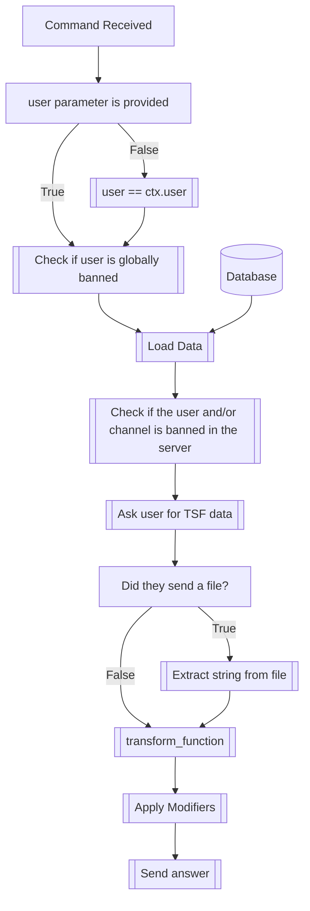

## Syntax
`/import_tf <user>`

- `user`: A valid Discord User to import the transformation data to. If not provided,
          the user executing the command will be used.

---

## Usage
The `/import_tf` command is used in coordination with the [`/export_tf`](export_tf.md)
to save and load transformation data to and from files and/or strings.

---

## Simplified internal logic

!!! note
    For more information on the TSF data format, see the documentation for the
    [`/export_tf`](export_tf.md#transformation-string-format) command.

!!! note
    For more information on `transform_function`, see the documentation for the
    [`/transform`](transform.md#the-transform_function) command.