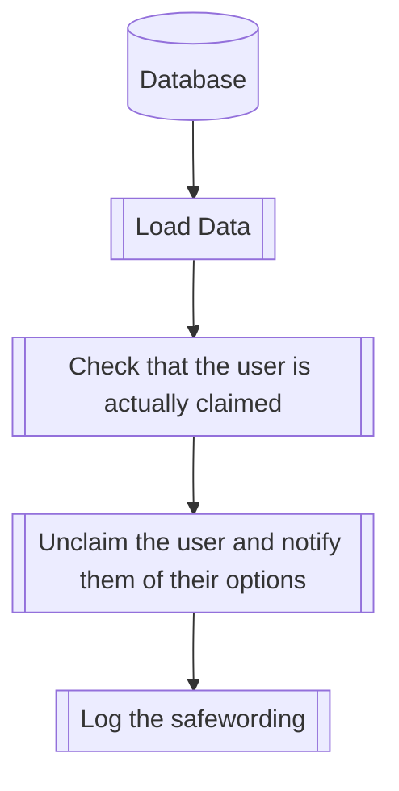

## Syntax
`/safeword`

---

## Usage
The `/safeword` command allows a claimed user to forcefully unclaim themselves, be it
because their claimer forgot to do so, because they are on a rush, or because they
feel uncomfortable or abused.

!!! danger
    If you feel like uncomfortable, or like your roleplay partners are abusing or
    mistreating you, try to talk to the server's staff. If this doesn't work, use
    the [`/report`](../others/report.md) command, or send "report" to the bot on
    its DMs.

    If this situation is server-wide and you feel like they are misusing the bot,
    please feel free to [contact us](../../about.md#contact)

---

## Simplified internal logic
