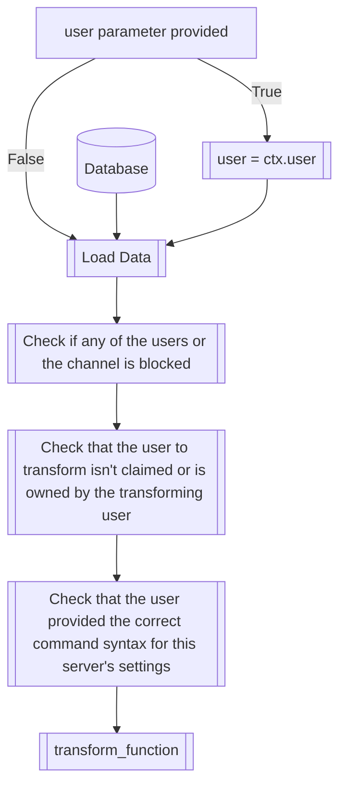
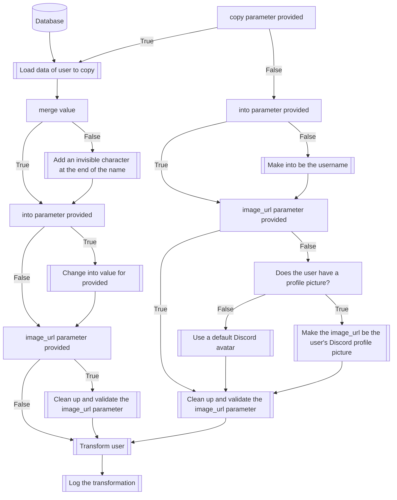

## Syntax
`/transform <user> <into> <image_url> <channel> <brackets> <copy> <merge>`

- `user`: A valid Discord User, representing the user to be transformed. If left
          empty, will transform the user executing the command.

- `into`: A string, that will be used as the name of the transformed user.

- `image_url`: A valid URL pointing to an image, that will be used as the avatar
               for the transformed user.

- `channel`: A valid Discord Channel. If provided, will make the transformation
             exclusive to that channel. On the contrary, if it isn't provided, the
             transformation will apply for all the server's channels, except any
             that are blocked.

- `brackets`: A string with the format of "<front brackets>text<back brackets>".
              Only works in servers that have enabled this feature, and will make
              the transformations exclusively happen when the brackets are used,
              similar to the working principle of TupperBox.

- `copy`: A valid Discord User. If provided, will copy the transformation data,
          including modifiers from said user. All the other parameters can still
          be provided, and will simply override whatever values the other user had
          set for them.
!!! warning
    If no `into` is separately provided, the name of the avatar
    will have an extra invisible character added to the end of their name, so
    that their messages don't merge with the original transformed user's. See
    the [Basic Twinning Tutorial](../../tutorials/twinning.md) for more info.

- `merge`: A boolean. Only provide if `copy` is also provided. Won't have any effect
           otherwise. It will make it so that copied users do not have the extra
           invisible character added at the end. See `copy` parameter for more info.

---

## Usages
This command has three different usages, as described in the
[Basic TransforMate Tutorial](../../tutorials/basic.md). You can provide only the
`user`, `channel`, and/or `brackets` parameters to do a two-step transformation.
Providing `into` and `image_url` will make a normal transformation, and providing
`copy`, and, optionally, `merge`, will make a twinning/merging transformation.

---

## Simplified internal logic

### The `transform_function`
The `transform_function` is a utility function inside the code of TransforMate that
is used through many of the transformation category commands, and contains most of
the transformation logic. Following here is an approximation of said logic.

